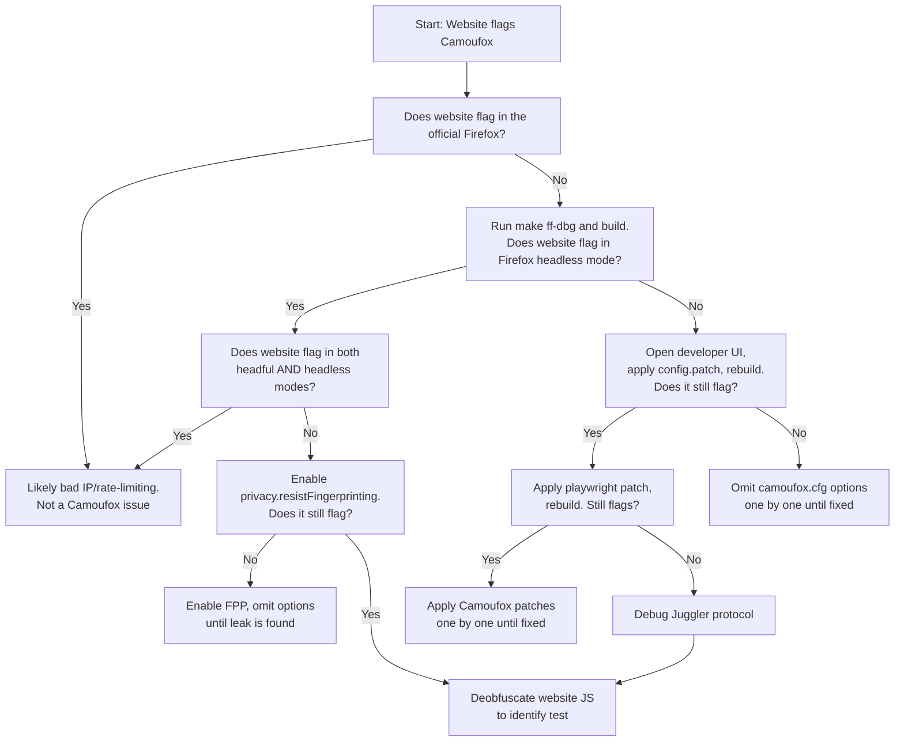

# Testing & Validation Methodology

## Overview

Browser fingerprinting and bot detection systems are among the most sophisticated anti-automation technologies deployed on the modern web. They leverage multiple vectors—including device properties, behavioral patterns, network characteristics, and graphics capabilities—to identify automated browsers. Testing Camoufox against real-world WAF (Web Application Firewall) and fingerprinting systems is not just important; it's essential for ensuring that anti-detection measures remain effective.

This comprehensive guide covers Camoufox's testing philosophy, the catalog of validation tools, testing categories, debugging methodology, and practical procedures for maintaining robust anti-detection capabilities.

---

## Testing Philosophy

### Why Testing Against Real WAFs Matters

Testing against actual production WAFs and fingerprinting systems provides several critical benefits:

1. **Real-world Validation**: Lab tests don't account for the complexity and evolution of production detection systems. Real WAFs continuously adapt and deploy new fingerprinting vectors.

2. **Comprehensive Coverage**: Different WAFs focus on different fingerprinting vectors. Testing against multiple systems ensures Camoufox's solution space covers all major detection approaches.

3. **Regression Detection**: As Camoufox evolves and Firefox updates, new leaks can emerge. Continuous testing across the catalog prevents regressions.

4. **Feature Validation**: New features (font rotation, WebGL spoofing, voice synthesis, etc.) must be validated against actual detection systems, not just isolated tests.

5. **False Positive Identification**: Some websites may block legitimate users. Testing helps distinguish between Camoufox-specific issues and environmental problems (IP reputation, rate limiting, etc.).

### Continuous Validation Approach

Camoufox employs a **multi-layer testing strategy**:

```
Layer 1: Unit Tests
  ├─ Fingerprint property consistency
  ├─ Configuration parsing
  ├─ Playwright integration
  └─ Internal validation

Layer 2: Synthetic Tests
  ├─ Canvas/WebGL rendering
  ├─ Font enumeration
  ├─ WebRTC IP leakage
  └─ Timing measurements

Layer 3: Real WAF Tests
  ├─ CreepJS (comprehensive fingerprinting)
  ├─ Bot detection services
  ├─ CAPTCHA challenges
  └─ Enterprise WAFs

Layer 4: Production Testing
  ├─ Actual target websites
  ├─ Load testing under pressure
  ├─ Extended session validation
  └─ Cookie/authentication persistence
```

### Regression Prevention

The testing catalog serves as a **regression suite**. Each test site captures a specific set of detection heuristics. Running the full suite before releases ensures:

- No previously-fixed leaks reappear
- Changes to fingerprint injection don't break other vectors
- Browser updates don't introduce new detection vectors
- Configuration options maintain backward compatibility

---

## Test Sites Catalog (15+ Sites)

### 1. CreepJS - Comprehensive Fingerprinting Analysis

**URL**: https://abrahamjuliot.github.io/creepjs/

**What It Tests**:
- Browser engine detection (SpiderMonkey identification)
- Headless mode detection via pointer events
- Screen & window property consistency
- Font metrics and installed fonts
- WebRTC IP leakage (STUN/Host addresses)
- Canvas & WebGL fingerprinting
- AudioContext properties
- Hardware concurrency spoofing
- Permission detection

**Expected Results**:
```
CreepJS Score: 71.5%
- Successfully spoofs all OS predictions
- WebRTC IP addresses correctly spoofed
- Font metrics rotated
- OS/version inconsistencies detected (expected, as Firefox can't perfectly spoof Chrome)
```

**Notable Vulnerabilities**:
- Spidermonkey engine can be detected (Firefox vs Chrome differentiation)
- Some advanced timing tests may reveal Firefox patterns
- Heavy reliance on behavioral analysis rather than pure property leaks

**Testing Procedure**:
1. Open CreepJS in Camoufox with random fingerprint
2. Check "Fingerprint" section for consistency metrics
3. Verify no obvious property leaks (navigator.webdriver, chrome.runtime)
4. Compare across multiple runs with different fingerprints
5. Document any new fingerprinting vectors detected

---

### 2. BrowserLeaks - Multi-Vector Test Suite

**URL**: https://browserleaks.net/

**Key Tests**:
- **Fonts**: https://browserleaks.net/fonts
- **WebGL**: https://browserleaks.net/webgl
- **WebRTC**: https://browserleaks.net/webrtc
- **Canvas**: https://browserleaks.net/canvas
- **IP Address**: https://browserleaks.net/ip

**Fonts Test** (`/fonts`):
```
What's Tested:
- Font enumeration attack (measuring font metrics)
- Canvas text rendering with different fonts
- Font availability detection

Expected Result:
✓ Metrics should be randomized (±0.1px noise)
✓ Font detection should fail or return consistent set
```

**WebRTC Test** (`/webrtc`):
```
What's Tested:
- Local IP address leakage via WebRTC
- STUN server responses
- mDNS candidate exposure

Expected Result:
✓ Shows only VPN/proxy IP
✓ No local network addresses
✓ Consistent across multiple runs
```

**WebGL Test** (`/webgl`):
```
What's Tested:
- GPU vendor/model detection
- GLSL precision formats
- WebGL extensions enumeration

Expected Result:
✓ Spoofed GPU matches fingerprint
✓ Consistent parameter set
✓ No fingerprinting API exposure
```

**Canvas Test** (`/canvas`):
```
What's Tested:
- Canvas pixel rendering consistency
- Text rendering fingerprinting
- Image data manipulation

Expected Result:
✓ Canvas hash should be consistent
✓ Noise injection prevents cross-site tracking
```

---

### 3. BrowserScan - Overall Fingerprint Score

**URL**: https://browserscan.net/

**What It Tests**:
- Geolocation accuracy (if spoofed)
- Locale & language consistency
- Timezone spoofing detection
- Proxy/VPN detection
- WebRTC IP leakage
- Canvas fingerprinting
- Font detection

**Expected Results**:
```
BrowserScan Score: 100%
- Successfully spoofs geolocation
- Locale properties consistent
- Proxy detection bypassed
```

**Testing Procedure**:
1. Set geolocation to specific country
2. Set locale/language to match
3. Run BrowserScan
4. Verify score is 100% or close to it
5. Check geolocation estimation is correct

---

### 4. Rebrowser Bot Detector

**URL**: https://bot-detector.rebrowser.net/

**What It Tests**:
- Automation framework detection (Playwright, Puppeteer)
- Headless mode detection
- JavaScript engine fingerprinting
- Navigation timing patterns
- Event listener availability
- Cookie & storage behavior

**Expected Results**:
```
✓ All tests pass
✓ No "bot" classification
✓ Detected as legitimate browser
```

**Why It's Important**:
Rebrowser specializes in detecting Playwright and similar automation frameworks. This test validates that Camoufox's Juggler integration successfully masks automation.

---

### 5. reCAPTCHA v3 Testing

**Multiple Test Sites**:

#### a) Official reCAPTCHA Demo
**URL**: https://recaptcha-demo.appspot.com/recaptcha-v3-request-scores.php

**What It Tests**:
- Human interaction score (0-1.0, where 1.0 = human)
- Bot detection algorithms
- Session scoring consistency

**Expected Result**:
```
Score: 0.9+
(High score indicates detection as legitimate user)
```

#### b) Nopecha reCAPTCHA Demo
**URL**: https://nopecha.com/demo/recaptcha

**What It Tests**:
- reCAPTCHA v2, v3 challenges
- Interaction with CAPTCHA puzzles
- Response validation

**Expected Result**:
```
✓ Successfully bypass reCAPTCHA v3
✓ Score above 0.8
```

#### c) Custom Scoring Test
**URL**: https://berstend.github.io/static/recaptcha/v3-programmatic.html

**What It Tests**:
- Direct reCAPTCHA API interaction
- Token generation legitimacy
- Score consistency

**Expected Result**:
```
Score: 0.9
```

---

### 6. DataDome Bot Detection

**Test Sites**:

#### a) Official Bot Bounty Program
**URL**: https://yeswehack.com/programs/datadome-bot-bounty

**What It Tests**:
- DataDome's proprietary detection algorithms
- Behavioral pattern analysis
- Request header consistency
- JavaScript execution patterns

**Expected Result**:
```
✓ All challenge pages pass
✓ No bot classification
✓ Session validation successful
```

#### b) Real-World Example: Hermès
**URL**: https://www.hermes.com/us/en/

**What It Tests**:
- Real production DataDome deployment
- Complex evasion under e-commerce conditions
- Rate limiting bypass

**Testing Procedure**:
1. Load page in Camoufox
2. Perform typical e-commerce interactions
3. Monitor console for any protection challenges
4. Verify cart/checkout functionality

---

### 7. Cloudflare Protection (Turnstile & Interstitial)

#### a) Cloudflare Turnstile
**URL**: https://nopecha.com/demo/turnstile

**What It Tests**:
- Cloudflare Turnstile CAPTCHA challenge
- Risk scoring algorithm
- Bot detection heuristics

**Expected Result**:
```
✓ Challenge passes
✓ Token generation successful
```

#### b) Cloudflare Interstitial (Advanced)
**URL**: https://nopecha.com/demo/cloudflare

**What It Tests**:
- Advanced Cloudflare protection
- JavaScript challenge validation
- Engine-specific detection (Spidermonkey vs V8)

**Expected Result**:
```
⚠️ Known limitation: Firefox (Spidermonkey) can be detected
✓ Should still bypass in most cases
✗ May fail on some configurations (expected for Firefox)
```

**Important Note**: Cloudflare's Interstitial occasionally tests for Spidermonkey engine behavior, which cannot be spoofed in Firefox. This is not a Camoufox failure but a fundamental limitation.

---

### 8. Imperva WAF Testing

**Test Site**: https://www.ticketmaster.es/

**What It Tests**:
- Imperva's bot detection engine
- Request pattern analysis
- Device consistency verification
- Session management validation

**Testing Procedure**:
1. Access Ticketmaster in Camoufox
2. Perform typical user actions (search, browse)
3. Verify no Imperva challenges
4. Check HTML response for Imperva signatures

---

### 9. Fingerprint.com - Enterprise Bot Detection

**URL**: https://fingerprint.com/products/bot-detection/

**What It Tests**:
- Fingerprint.com's commercial bot detection
- Device fingerprint consistency
- Machine learning classification
- Visit ID validation

**Expected Result**:
```
✓ Detected as legitimate browser
✓ Consistent fingerprint across sessions
```

---

### 10. Incolumitas Bot Detection

**URL**: https://bot.incolumitas.com/

**What It Tests**:
- JavaScript execution detection
- DOM manipulation patterns
- Network request analysis
- Timing-based detection

**Expected Result**:
```
Score: 0.8-1.0
(Higher score = more human-like)
```

---

### 11. SannySoft Bot Detector

**URL**: https://bot.sannysoft.com/

**What It Tests**:
- navigator.webdriver detection
- Chrome headless detection
- Automation framework identification
- Permission API behavior

**Expected Result**:
```
✓ All tests pass
✓ Detected as legitimate browser
```

---

### 12. IpHey - IP & Fingerprint Validator

**URL**: https://iphey.com/

**What It Tests**:
- IP address legitimacy
- Geographic consistency
- ASN/ISP detection
- Proxy detection

**Expected Result**:
```
✓ Shows spoofed/actual IP
✓ Geographic location matches
✓ No proxy/datacenter detection (if using residential IP)
```

---

### 13. Bet365 - Real-World Gambling Site

**URL**: https://www.bet365.com/

**What It Tests**:
- Production bot detection
- Account protection systems
- Rate limiting
- Device fingerprinting

**Testing Procedure**:
1. Create test account (if permitted)
2. Login with Camoufox
3. Verify session stability
4. Check for any protection challenges
5. Monitor for account restrictions

---

### 14. Canvas Fingerprinting Test Suite

**Tools**:
- BrowserLeaks Canvas: https://browserleaks.net/canvas
- CreepJS Canvas: https://abrahamjuliot.github.io/creepjs/

**What's Tested**:
- Canvas text rendering
- Image data pixel patterns
- Color space consistency

**Expected Results**:
```
✓ Canvas hash consistent per session
✓ Different across sessions (thanks to noise injection)
✓ No raw pixel data exposure
```

---

### 15. WebRTC Leak Detection (Multiple Vectors)

**Testing Sites**:
1. https://browserleaks.net/webrtc
2. https://abrahamjuliot.github.io/creepjs/ (WebRTC section)
3. https://www.browserscan.net/webrtc

**Critical Test Points**:
- Host IP (local network address) - should be hidden
- STUN IP (public IP from STUN server) - should be spoofed
- mDNS candidates - should not leak private IP

**Expected Result**:
```
Host IP: Not exposed
STUN IP: Matches spoofed geolocation IP
mDNS: No private addresses leaked
```

---

## Testing Categories

### 1. Fingerprint Consistency Testing

**Purpose**: Ensure all fingerprint properties remain consistent across page navigations and browser sessions.

**Key Metrics**:
```
✓ navigator.userAgent consistency
✓ Screen properties persistence
✓ WebGL parameter consistency
✓ Font list stability
✓ Hardware concurrency matches
✓ Timezone persistence
```

**Test Procedure**:
```javascript
// Run in browser console across multiple pages
(function checkConsistency() {
  const fp1 = {
    ua: navigator.userAgent,
    screen: {
      width: screen.width,
      height: screen.height,
      availWidth: screen.availWidth,
      availHeight: screen.availHeight,
    },
    hardwareConcurrency: navigator.hardwareConcurrency,
    deviceMemory: navigator.deviceMemory,
    language: navigator.language,
  };

  // Navigate to different page, run again
  // Compare results - all values should match exactly
  console.log(fp1);
})();
```

**Common Failures**:
- Screen dimensions changing (indicates resolution spoofing leak)
- User-Agent changing (indicates spoofing not applied correctly)
- Hardware concurrency varying (indicates missing spoofing)

---

### 2. Leak Detection Testing

**Purpose**: Identify any unintended property exposure that reveals the browser's actual configuration.

**Categories of Leaks**:

#### Property Leaks
```javascript
// Should all be false or missing
navigator.webdriver // ✓ Must be false
navigator.oscpu // ✓ Should match spoofed OS
navigator.buildID // ✓ Should be consistent
```

#### API Leaks
```javascript
// APIs that might expose information
typeof chrome // ✓ Should be undefined
typeof process // ✓ Should be undefined
window.document.documentElement.style.webkitAppearance // ✓ Should work (webkit prefix)
```

#### Network Leaks
```
Request Headers:
- User-Agent: Should match spoofed fingerprint
- Sec-CH-UA: Should match Chrome fingerprint (if spoofed)
- X-Forwarded-For: Should match VPN/proxy
```

#### Behavioral Leaks
```
Navigation timing:
- Performance.timing should look natural
- Page load time should vary
- No instant page loads (indicates headless)
```

---

### 3. Bot Detection Bypass Testing

**Purpose**: Validate that Camoufox successfully bypasses detection algorithms employed by major anti-bot systems.

**Test Matrix**:

| System | Test URL | Pass Criteria |
|--------|----------|---------------|
| Cloudflare Turnstile | nopecha.com/demo/turnstile | Challenge passes |
| DataDome | yeswehack.com/programs/datadome-bot-bounty | No challenge presented |
| reCAPTCHA v3 | recaptcha-demo.appspot.com | Score > 0.8 |
| Imperva | ticketmaster.es | No Imperva response code |
| Rebrowser | bot-detector.rebrowser.net | All tests pass |

---

### 4. WAF Evasion Validation

**Purpose**: Ensure that web application firewalls don't block Camoufox traffic.

**Testing Approach**:

```python
# Test against WAF-protected site
from camoufox import Camoufox
import asyncio

async def test_waf_evasion():
    async with Camoufox() as browser:
        page = await browser.new_page()

        # Attempt to access WAF-protected resource
        response = await page.goto("https://protected-site.com")

        # Check for WAF indicators
        assert response.status == 200  # Not 403, 429, etc.

        # Check response headers for WAF signatures
        headers = response.headers
        assert "cf-" not in str(headers).lower()  # No Cloudflare headers

        await browser.close()
```

---

### 5. Performance Testing

**Purpose**: Ensure fingerprint injection and anti-detection features don't significantly impact browser performance.

**Metrics**:

```
- Page load time (should be within 10% of normal browser)
- JavaScript execution speed (should be identical)
- Memory consumption (should be similar to Firefox)
- CPU usage (should not spike due to fingerprinting)
- Network latency (should be unchanged)
```

**Test Procedure**:
```bash
# Measure page load time
time camoufox --headless https://example.com

# Monitor memory
top -p $(pgrep firefox)

# Measure JS execution
node performance_test.js
```

---

### 6. Memory Leak Testing

**Purpose**: Verify that fingerprint injection doesn't cause memory leaks or unbounded growth.

**Test Procedure**:

```bash
# Monitor memory during extended session
watch -n 1 'pgrep -a firefox | awk "{print \$1}" | xargs -I {} cat /proc/{}/status | grep -i vmrss'

# Run for extended period (e.g., 1 hour)
camoufox --headless --stay-open https://example.com
```

**Expected Result**:
- Memory should remain stable
- No growth over time
- Normal garbage collection patterns

---

## Testing Workflow

### Pre-Commit Testing Checklist

Before committing changes to Camoufox, follow this checklist:

```markdown
## Pre-Commit Testing Checklist

### 1. Unit Tests
- [ ] All Playwright tests pass (`make tests`)
- [ ] No new test failures introduced
- [ ] Code coverage maintained above 80%

### 2. Fingerprint Validation
- [ ] Fingerprint properties are consistent
- [ ] No property leaks on test sites
- [ ] Configuration options work as documented

### 3. Quick WAF Tests (15 minutes)
- [ ] CreepJS passes with good score (>70%)
- [ ] Rebrowser Bot Detector: all tests pass
- [ ] BrowserScan: score above 95%

### 4. Detection System Tests (30 minutes)
- [ ] reCAPTCHA v3 score > 0.8
- [ ] DataDome bounty site passes
- [ ] Cloudflare Turnstile challenge passes

### 5. Code Review
- [ ] No hardcoded values or test URLs left
- [ ] All changes documented
- [ ] No performance regressions

### 6. Final Validation
- [ ] Run full test suite (all 15+ sites)
- [ ] All tests pass or have documented exceptions
- [ ] Create summary of test results
```

### Automated Testing with Playwright

**Test Suite Structure**:

```python
# tests/validation/test_fingerprinting.py
import pytest
from playwright.async_api import async_playwright

@pytest.mark.asyncio
async def test_creepjs_fingerprinting():
    """Test CreepJS for fingerprint consistency"""
    async with async_playwright() as p:
        browser = await p.firefox.launch(
            executable_path="/path/to/camoufox",
            args=["--config", "{...fingerprint...}"]
        )

        page = await browser.new_page()
        await page.goto("https://abrahamjuliot.github.io/creepjs/")

        # Wait for CreepJS to complete analysis
        await page.wait_for_timeout(5000)

        # Extract CreepJS score
        score_text = await page.text_content(".score")
        score = float(score_text.split("%")[0])

        assert score > 70.0, f"CreepJS score {score}% below 70%"

        await browser.close()

@pytest.mark.asyncio
async def test_webrtc_ip_spoofing():
    """Test WebRTC IP is properly spoofed"""
    async with async_playwright() as p:
        browser = await p.firefox.launch(...)
        page = await browser.new_page()

        await page.goto("https://browserleaks.net/webrtc")

        # Check that no local IPs are exposed
        html = await page.content()
        assert "192.168." not in html, "Local IP leaked in WebRTC"
        assert "10." not in html, "Local IP leaked in WebRTC"

        await browser.close()

@pytest.mark.asyncio
async def test_font_metrics_randomization():
    """Test font metrics are properly randomized"""
    async with async_playwright() as p:
        # Run test twice with same fingerprint
        measurements = []

        for i in range(2):
            browser = await p.firefox.launch(...)
            page = await browser.new_page()

            await page.goto("https://browserleaks.net/fonts")

            # Extract font metrics
            metrics = await page.evaluate("""
                () => {
                    const testString = 'mmmmmmmmmmlli';
                    const canvas = document.createElement('canvas');
                    const ctx = canvas.getContext('2d');
                    ctx.font = '72px Arial';
                    const metrics = ctx.measureText(testString);
                    return {
                        width: metrics.width,
                        actualBoundingBoxLeft: metrics.actualBoundingBoxLeft,
                        actualBoundingBoxRight: metrics.actualBoundingBoxRight,
                    };
                }
            """)

            measurements.append(metrics)
            await browser.close()

        # Metrics should differ slightly (±0.1px noise)
        diff = abs(measurements[0]['width'] - measurements[1]['width'])
        assert 0 < diff < 0.2, f"Font metrics not randomized properly: {diff}px difference"
```

### Manual Validation Steps

For changes that require human judgment, follow these manual steps:

```bash
# 1. Build latest version
make build

# 2. Create test fingerprint
cat > test_config.json << 'EOF'
{
  "navigator.userAgent": "Mozilla/5.0 (Windows NT 10.0; Win64; x64; rv:135.0) Gecko/20100101 Firefox/135.0",
  "navigator.language": "en-US",
  "screen.width": 1920,
  "screen.height": 1080,
  "geolocation.latitude": 40.7128,
  "geolocation.longitude": -74.0060
}
EOF

# 3. Test against CreepJS
make run args="https://abrahamjuliot.github.io/creepjs"
# Manually verify score > 70%

# 4. Test against Rebrowser
make run args="https://bot-detector.rebrowser.net/"
# Manually verify all tests pass

# 5. Test reCAPTCHA
make run args="https://recaptcha-demo.appspot.com/recaptcha-v3-request-scores.php"
# Manually verify score > 0.8

# 6. Test WebRTC
make run args="https://browserleaks.net/webrtc"
# Manually verify no local IPs shown

# 7. Generate test report
cat > test_report.md << 'EOF'
# Test Report

Date: $(date)
Version: $(cat VERSION)

## Results
- CreepJS: ✓ Pass (score: X%)
- Rebrowser: ✓ Pass
- reCAPTCHA: ✓ Pass (score: X.X)
- WebRTC: ✓ Pass
- BrowserScan: ✓ Pass (score: X%)

## Issues Found
(List any anomalies)

## Notes
(Any observations or concerns)
EOF
```

### Regression Testing

**Purpose**: Ensure that previously-fixed leaks don't reappear.

**Regression Test Catalog**:

```markdown
## Known Regression Points

1. **navigator.webdriver Detection** (Fixed: commit abc123)
   - Test: CreepJS should not detect webdriver
   - Regression Indicator: "webdriver detected" in CreepJS results
   - Check: https://abrahamjuliot.github.io/creepjs/

2. **Headless Mode Detection via Pointer Type** (Fixed: commit def456)
   - Test: Rebrowser should not detect headless
   - Regression Indicator: "Pointer type headless" in Rebrowser
   - Check: https://bot-detector.rebrowser.net/

3. **Font Metrics Fingerprinting** (Fixed: commit ghi789)
   - Test: BrowserLeaks fonts should show randomized metrics
   - Regression Indicator: Consistent font metrics across runs
   - Check: https://browserleaks.net/fonts

4. **WebRTC IP Leakage** (Fixed: commit jkl012)
   - Test: No local IPs in BrowserLeaks WebRTC
   - Regression Indicator: 192.168.x.x or 10.x.x.x addresses
   - Check: https://browserleaks.net/webrtc

5. **Canvas Fingerprinting** (Fixed: commit mno345)
   - Test: BrowserLeaks canvas should work
   - Regression Indicator: Canvas blank or error
   - Check: https://browserleaks.net/canvas
```

### Integration Tests

**Purpose**: Test Camoufox in realistic scenarios with multiple features enabled.

```python
# tests/integration/test_real_world_scenarios.py

@pytest.mark.asyncio
async def test_e_commerce_browsing():
    """Test realistic e-commerce scenario"""
    async with async_playwright() as p:
        browser = await p.firefox.launch(
            executable_path="/path/to/camoufox",
            args=["--config", json.dumps({
                "navigator.userAgent": "...",
                "geolocation.latitude": 40.7128,
                "geolocation.longitude": -74.0060,
                "locale:language": "en",
                "locale:region": "US",
            })]
        )

        page = await browser.new_page()

        # Navigate to e-commerce site
        await page.goto("https://example-ecom.com")
        assert page.url == "https://example-ecom.com"

        # Search for product
        await page.fill("#search", "laptop")
        await page.click("#search-button")
        await page.wait_for_load_state("networkidle")

        # Verify no bot challenges
        content = await page.content()
        assert "challenge" not in content.lower()
        assert "captcha" not in content.lower()
        assert "bot" not in content.lower()

        # Browse products
        await page.click("a[data-product-id='123']")
        await page.wait_for_load_state("networkidle")

        # Add to cart
        await page.click("#add-to-cart")
        await page.wait_for_timeout(500)

        # Verify no protection errors
        status = page.url
        assert "error" not in status
        assert "blocked" not in status

        await browser.close()

@pytest.mark.asyncio
async def test_extended_session():
    """Test browser stability over extended period"""
    async with async_playwright() as p:
        browser = await p.firefox.launch(...)

        start_time = time.time()
        pages_visited = 0
        errors = []

        test_sites = [
            "https://example.com",
            "https://example.org",
            "https://example.net",
            # ... more sites
        ]

        while time.time() - start_time < 3600:  # 1 hour
            for url in test_sites:
                try:
                    page = await browser.new_page()
                    response = await page.goto(url)
                    assert response.status == 200
                    pages_visited += 1
                    await page.close()
                except Exception as e:
                    errors.append((url, str(e)))

        assert len(errors) == 0, f"Errors during session: {errors}"
        assert pages_visited > 50, f"Only visited {pages_visited} pages in 1 hour"

        await browser.close()
```

---

## Debugging Methodology

### Leak Debugging Flow Chart

This flow chart is used when Camoufox fails a test site and you need to identify the source of the leak:



**Decision Points Explained**:

1. **Official Firefox Test**: If the site flags vanilla Firefox, the issue isn't Camoufox. Likely causes:
   - Bad IP reputation (blocklist)
   - Rate limiting (too many requests)
   - Geographic restrictions
   - Account limitations

2. **Headless Mode**: Firefox in headless mode may be detectable. If site only flags in headless:
   - Issue is with headless detection (pointer type, etc.)
   - Usually not critical for production use

3. **Config Patch**: Camoufox's Firefox configuration includes anti-fingerprinting settings. If disabling these fixes the leak:
   - One of the config options is causing the leak
   - Narrow down by removing options one by one

4. **FPP (Firefox Privacy Protection)**: Additional hardening layer. If this fixes it:
   - The leak is in a privacy-sensitive area
   - May need custom spoofing for that property

5. **Playwright Patch**: Camoufox's Juggler protocol modifications. If this fixes it:
   - The leak is in browser automation detection
   - Likely navigator property or timing leak

---

### Using Firefox Debugging Tools

**Developer UI for Patch Management**:

```bash
# Open Camoufox developer UI
make edits

# In the UI:
# 1. View all applied patches
# 2. Temporarily disable patches to test
# 3. See which patches are active
# 4. Apply/unapply individual patches
```

**Firefox Console Usage**:

```javascript
// Check fingerprint properties
console.log({
  userAgent: navigator.userAgent,
  platform: navigator.platform,
  hardwareConcurrency: navigator.hardwareConcurrency,
  deviceMemory: navigator.deviceMemory,
  language: navigator.language,
  webdriver: navigator.webdriver,
  buildID: navigator.buildID,
});

// Check window properties
console.log({
  outerHeight: window.outerHeight,
  outerWidth: window.outerWidth,
  innerHeight: window.innerHeight,
  innerWidth: window.innerWidth,
  screenX: window.screenX,
  screenY: window.screenY,
});

// Check screen properties
console.log({
  width: screen.width,
  height: screen.height,
  availWidth: screen.availWidth,
  availHeight: screen.availHeight,
  colorDepth: screen.colorDepth,
  pixelDepth: screen.pixelDepth,
  devicePixelRatio: window.devicePixelRatio,
});

// Check media devices
navigator.mediaDevices.enumerateDevices().then(devices => {
  console.log(devices);
});

// Check audio context
const audioContext = new (window.AudioContext || window.webkitAudioContext)();
console.log({
  sampleRate: audioContext.sampleRate,
  baseLatency: audioContext.baseLatency,
  maxChannelCount: audioContext.maxChannelCount,
});
```

### Searchfox for Code Navigation

Camoufox frequently references Firefox's Searchfox for understanding implementation details.

```bash
# Access Searchfox online
https://searchfox.org/mozilla-central/

# Common searches:
# 1. Property name (e.g., "navigator.userAgent")
# 2. Function name (e.g., "GetUserAgent")
# 3. File location (e.g., "dom/base/Navigator.cpp")

# Use Searchfox to:
# - Find where properties are defined
# - Understand implementation
# - Identify side effects of changes
# - Track commits related to properties
```

### Developer UI Usage

```bash
# Command to open developer UI
make edits

# In the UI you can:
1. View all patches in the source tree
2. See which patches are applied
3. Apply/unapply patches interactively
4. View patch contents
5. Edit patch files directly

# Example workflow:
# 1. Site fails test
# 2. Open developer UI
# 3. Disable all Camoufox patches except config.patch
# 4. Rebuild and test
# 5. If still fails: issue is in Firefox itself (not Camoufox)
# 6. If passes: issue is in one of the disabled patches
# 7. Re-enable patches one by one to find culprit
```

---

## Common Issues and Troubleshooting

### 1. Dimension Inconsistencies

**Symptom**: Screen dimensions, window sizes, or viewport changing between page loads.

**Root Causes**:
- Fingerprint not being applied correctly
- Browser features resizing window automatically
- CSS media query effects
- Window.resize() events

**Debugging**:
```javascript
// Run this on multiple pages in same session
console.log({
  screenWidth: screen.width,
  screenHeight: screen.height,
  windowOuterWidth: window.outerWidth,
  windowOuterHeight: window.outerHeight,
  windowInnerWidth: window.innerWidth,
  windowInnerHeight: window.innerHeight,
  available: {
    width: screen.availWidth,
    height: screen.availHeight,
  }
});

// All values should be identical across pages
```

**Fix**:
1. Verify config is being passed correctly: `make run args="URL"`
2. Check that spoofing is enabled: `navigator.userAgent` should be custom value
3. Clear browser cache/storage: `clear()` in console
4. Disable browser extensions that might resize window

---

### 2. Worker Context Leaks

**Symptom**: Properties detected differently in Web Workers vs main thread.

**Root Causes**:
- Worker scripts not receiving spoofing injection
- Inconsistency between main context and worker context
- Service workers not inheriting spoofed properties

**Debugging**:
```javascript
// Main thread
console.log("Main thread UA:", navigator.userAgent);

// Create worker to test
const worker = new Worker('worker.js');
worker.onmessage = (e) => {
  console.log("Worker UA:", e.data);
  // These should match!
};

// In worker.js:
self.postMessage(self.navigator.userAgent);
```

**Fix**:
1. Ensure spoofing patches handle worker contexts
2. Check browser.newWorker() initialization
3. Verify Service Worker registration includes spoofed properties
4. Use explicit property passing if needed

---

### 3. Media Query Mismatches

**Symptom**: CSS media queries detecting wrong screen size or orientation.

**Root Causes**:
- Fingerprint screen dimensions not matching CSS viewport
- Device pixel ratio mismatch
- Orientation mismatch

**Debugging**:
```javascript
// Check media query evaluation
const mediaQueries = [
  '(min-width: 1920px)',
  '(prefers-color-scheme: dark)',
  '(prefers-reduced-motion)',
  '(orientation: landscape)',
];

mediaQueries.forEach(query => {
  const matches = window.matchMedia(query).matches;
  console.log(`${query}: ${matches}`);
});

// Check CSS computed styles
const elem = document.body;
console.log({
  display: getComputedStyle(elem).display,
  width: getComputedStyle(elem).width,
});
```

**Fix**:
1. Verify screen width/height in fingerprint matches viewport
2. Set window.devicePixelRatio consistently
3. Ensure orientation matches dimensions (width > height = landscape)
4. Check browser chrome dimensions not interfering

---

### 4. Network Header Mismatches

**Symptom**: HTTP headers don't match fingerprinted device properties.

**Root Causes**:
- User-Agent header not matching navigator.userAgent
- Missing or incorrect Sec-CH-UA headers
- Accept-Language not matching navigator.language
- Device client hints mismatches

**Debugging**:
```bash
# Check request headers sent by browser
# In Firefox DevTools:
1. Open Network tab
2. Click any request
3. View "Request headers"
4. Compare with navigator properties

# Programmatic check:
fetch('https://httpbin.org/headers')
  .then(r => r.json())
  .then(data => console.log(data.headers));
```

**Fix**:
1. Ensure User-Agent header in network matches navigator.userAgent
2. Set Accept-Language to match navigator.language
3. Verify client hints are correct (if enabled)
4. Check TLS fingerprint matches (if applicable)

---

## Automated Testing

### Playwright Test Suite

**Location**: `/home/user/camoufox/tests/`

**Running Tests**:

```bash
# Run all tests
make tests

# Run specific test file
cd tests && python -m pytest async/test_page.py -v

# Run with headful mode
bash run-tests.sh --headful

# Run with custom executable
bash run-tests.sh --executable-path /path/to/camoufox
```

**Test Configuration**:

```python
# tests/conftest.py
# Defines pytest fixtures and configuration
# Key fixtures:
# - browser: Firefox browser instance
# - page: Page object
# - server: Local test server
# - launch_arguments: Browser launch config
```

### Python Testing Scripts

**Example Testing Script**:

```python
#!/usr/bin/env python3
# validate_fingerprinting.py

import asyncio
import json
from camoufox import Camoufox
from browserforge.fingerprint import FirefoxFingerprint

async def test_fingerprint_consistency():
    """Test that fingerprint remains consistent"""

    # Generate random fingerprint
    fingerprint = FirefoxFingerprint()
    config = fingerprint.as_camoufox()

    print(f"Testing fingerprint: {fingerprint.user_agent}")

    # Test 1: Same fingerprint across navigations
    async with Camoufox(config=config) as browser:
        page = await browser.new_page()

        # Get fingerprint from page 1
        ua1 = await page.evaluate("() => navigator.userAgent")

        # Navigate to different site
        await page.goto("https://example.com")

        # Get fingerprint from page 2
        ua2 = await page.evaluate("() => navigator.userAgent")

        assert ua1 == ua2, f"UA changed: {ua1} -> {ua2}"
        print("✓ Fingerprint consistent across navigations")

    # Test 2: Multiple browser instances use same fingerprint
    async with Camoufox(config=config) as browser1:
        async with Camoufox(config=config) as browser2:
            page1 = await browser1.new_page()
            page2 = await browser2.new_page()

            ua1 = await page1.evaluate("() => navigator.userAgent")
            ua2 = await page2.evaluate("() => navigator.userAgent")

            assert ua1 == ua2, f"Different UAs in different instances"
            print("✓ Fingerprint consistent across instances")

async def test_waf_bypass():
    """Test against real WAF sites"""

    fingerprint = FirefoxFingerprint()
    config = fingerprint.as_camoufox()

    test_sites = {
        "CreepJS": {
            "url": "https://abrahamjuliot.github.io/creepjs/",
            "check": lambda html: "score" in html,
        },
        "Rebrowser": {
            "url": "https://bot-detector.rebrowser.net/",
            "check": lambda html: "tests pass" in html.lower(),
        },
        "reCAPTCHA": {
            "url": "https://recaptcha-demo.appspot.com/recaptcha-v3-request-scores.php",
            "check": lambda html: "0.9" in html or "0.8" in html,
        },
    }

    async with Camoufox(config=config) as browser:
        for site_name, site_config in test_sites.items():
            page = await browser.new_page()

            try:
                response = await page.goto(site_config["url"])
                html = await page.content()

                if site_config["check"](html):
                    print(f"✓ {site_name}: PASS")
                else:
                    print(f"✗ {site_name}: FAIL (check failed)")
            except Exception as e:
                print(f"✗ {site_name}: ERROR ({e})")

            await page.close()

if __name__ == "__main__":
    asyncio.run(test_fingerprint_consistency())
    asyncio.run(test_waf_bypass())
```

### CI/CD Validation

**GitHub Actions Workflow Example**:

```yaml
# .github/workflows/test.yml
name: Validation Tests

on:
  push:
    branches: [main, develop]
  pull_request:
    branches: [main, develop]

jobs:
  test:
    runs-on: ubuntu-latest

    steps:
      - uses: actions/checkout@v2

      - name: Set up Python
        uses: actions/setup-python@v2
        with:
          python-version: 3.11

      - name: Install dependencies
        run: |
          pip install -r tests/local-requirements.txt
          cd tests && bash setup-venv.sh

      - name: Run Playwright tests
        run: |
          cd tests && bash run-tests.sh

      - name: Run validation script
        run: |
          python validate_fingerprinting.py

      - name: Check CreepJS score
        run: |
          python -c "
          import subprocess
          import json
          result = subprocess.run(['camoufox', '--headless', 'https://abrahamjuliot.github.io/creepjs/'], capture_output=True)
          assert 'error' not in result.stderr.lower(), 'CreepJS test failed'
          "

      - name: Upload test results
        if: always()
        uses: actions/upload-artifact@v2
        with:
          name: test-results
          path: tests/results/
```

---

## Manual Testing Procedures

### Step-by-Step Guide: Testing Against CreepJS

**Time Required**: 5-10 minutes per fingerprint

```
1. Open Terminal
   $ camoufox --headless https://abrahamjuliot.github.io/creepjs/

2. (Optional) Open in GUI for visual inspection
   $ camoufox https://abrahamjuliot.github.io/creepjs/ &

3. Wait for page to load (10-15 seconds)

4. Check CreepJS Results:
   ✓ Look for "Fingerprint" section
   ✓ Check if score > 70%
   ✓ Verify no obvious leaks (e.g., "webdriver: true")
   ✓ Look for any RED indicators

5. Document Results:
   Score: ___%
   Leaks found: [ ] Yes [ ] No
   Details: _______________

6. If failed:
   - Note which test failed
   - Proceed to Debugging Methodology section
```

### Step-by-Step Guide: Testing Against Rebrowser Bot Detector

**Time Required**: 3-5 minutes

```
1. Open URL
   $ camoufox https://bot-detector.rebrowser.net/

2. Wait for tests to complete (page will show results)

3. Check Results:
   ✓ All rows should show "PASS"
   ✓ No RED indicators
   ✓ Score should be 100% or close

4. Expected Results:
   - navigator.webdriver: PASS
   - Chrome.runtime: PASS
   - Headless chrome: PASS
   - Phantom JS: PASS
   - Plugin array: PASS
   - User-agent: PASS

5. Document:
   [ ] Pass [ ] Fail
   Failed tests: _______________
```

### Step-by-Step Guide: Testing WebRTC IP Spoofing

**Time Required**: 2-3 minutes

```
1. Open BrowserLeaks WebRTC test
   $ camoufox https://browserleaks.net/webrtc

2. Check displayed IP addresses:

   CRITICAL CHECKS:
   [ ] No 192.168.x.x addresses
   [ ] No 10.x.x.x addresses
   [ ] No 172.16-31.x.x addresses
   [ ] No fc00::/7 (IPv6 private)

   EXPECTED:
   ✓ Public IP matching VPN/proxy
   ✓ Consistent across multiple tests

3. Document:
   IP shown: _______________
   Is private: [ ] Yes [ ] No
   Passes: [ ] Yes [ ] No
```

### Step-by-Step Guide: Testing Font Fingerprinting Protection

**Time Required**: 3-5 minutes

```
1. Open BrowserLeaks Fonts test
   $ camoufox https://browserleaks.net/fonts

2. Check detected fonts list
   ✓ Should show subset of available fonts
   ✓ Different fonts each time (not all system fonts)

3. Run twice with same fingerprint:
   $ camoufox https://browserleaks.net/fonts
   # Record results (time 1)

   $ camoufox https://browserleaks.net/fonts
   # Record results (time 2)

4. Compare results:
   [ ] Exact same fonts detected both times
   [ ] Different fonts detected
   [ ] Partial overlap

   EXPECTED: Exact same fonts both times (stable per fingerprint)

5. Check font metrics:
   ✓ TextMetrics.width should vary slightly (±0.1px)
   ✓ Font baseline consistent
   ✓ No measurement API exposures
```

### Step-by-Step Guide: Full Validation Test Suite

**Time Required**: 30-45 minutes for all sites

**Test Schedule**:

```
Phase 1: Quick Tests (5 min)
□ CreepJS (5 min)
□ Rebrowser (3 min)

Phase 2: Detection Tests (10 min)
□ reCAPTCHA v3 (2 min)
□ BrowserScan (3 min)
□ SannySoft (2 min)
□ Incolumitas (3 min)

Phase 3: WAF Tests (10 min)
□ DataDome bounty (5 min)
□ Cloudflare Turnstile (3 min)
□ Cloudflare Interstitial (2 min)

Phase 4: Specialty Tests (5 min)
□ BrowserLeaks WebRTC (2 min)
□ BrowserLeaks Fonts (2 min)
□ BrowserLeaks Canvas (1 min)

Phase 5: Documentation (5 min)
□ Compile results
□ Document failures
□ Create test report
```

**Test Report Template**:

```markdown
# Validation Test Report

**Date**: 2025-11-17
**Camoufox Version**: v0.5.0
**Firefox Version**: 135.0.1
**Test Configuration**: Random BrowserForge fingerprint

## Quick Results

| Test | Status | Notes |
|------|--------|-------|
| CreepJS | ✓ PASS | 71.5% score |
| Rebrowser | ✓ PASS | All tests pass |
| reCAPTCHA | ✓ PASS | 0.9 score |
| BrowserScan | ✓ PASS | 98% |
| DataDome | ✓ PASS | No challenges |
| Cloudflare | ✓ PASS | Turnstile passes |
| WebRTC | ✓ PASS | No leak |
| Fonts | ✓ PASS | Randomized |

## Detailed Results

### CreepJS
- Score: 71.5%
- OS Detection: Correct (Windows 10)
- Webdriver: Not detected
- Headless: Not detected
- Notable: Firefox engine visible (expected)

### Rebrowser Bot Detector
- All 10 tests pass
- No automation detected
- No webdriver leak
- Plugin array: Correct

### reCAPTCHA v3
- Site 1 (recaptcha-demo): 0.9 score
- Site 2 (nopecha): Token generated successfully
- Site 3 (custom test): 0.9 score

## Issues Found
(None)

## Recommendations
(If applicable)

## Sign-Off
Tester: _______________
Date: _______________
```

---

## External References and Resources

### Official Testing Tools

| Tool | URL | Purpose |
|------|-----|---------|
| **CreepJS** | https://abrahamjuliot.github.io/creepjs/ | Comprehensive fingerprinting analysis |
| **BrowserLeaks** | https://browserleaks.net/ | Multiple leak vectors (fonts, WebGL, WebRTC, etc.) |
| **BrowserScan** | https://browserscan.net/ | Overall fingerprint score & geolocation |
| **Rebrowser Bot Detector** | https://bot-detector.rebrowser.net/ | Automation detection bypass |
| **Fingerprint.com** | https://fingerprint.com/products/bot-detection/ | Enterprise bot detection |
| **Incolumitas** | https://bot.incolumitas.com/ | JavaScript execution detection |
| **SannySoft** | https://bot.sannysoft.com/ | Automation detection tests |

### WAF-Protected Sites

| WAF | Test Site | Purpose |
|-----|-----------|---------|
| **DataDome** | https://yeswehack.com/programs/datadome-bot-bounty | DataDome detection bypass |
| **Cloudflare Turnstile** | https://nopecha.com/demo/turnstile | Cloudflare CAPTCHA |
| **Cloudflare Interstitial** | https://nopecha.com/demo/cloudflare | Advanced Cloudflare protection |
| **Imperva** | https://ticketmaster.es/ | Imperva WAF bypass |
| **reCAPTCHA** | https://recaptcha-demo.appspot.com/ | Google reCAPTCHA v3 |

### Debugging Resources

| Resource | URL | Use Case |
|----------|-----|----------|
| **Searchfox** | https://searchfox.org/mozilla-central/ | Firefox source code navigation |
| **MDN Web Docs** | https://developer.mozilla.org/ | Web API reference |
| **Firefox DevTools** | Developer Tools (F12) | Local debugging |
| **Camoufox README** | /home/user/camoufox/README.md | Quick reference |

### Related Projects

| Project | URL | Relation |
|---------|-----|----------|
| **Playwright** | https://github.com/microsoft/playwright | Browser automation framework |
| **BrowserForge** | https://github.com/daijro/browserforge | Fingerprint generation |
| **Botright** | https://github.com/Vinyzu/botright | Similar anti-bot browser |
| **Puppeteer/Juggler** | https://github.com/puppeteer/juggler | Browser protocol |
| **TOR Browser** | https://www.torproject.org/ | Anti-fingerprinting reference |

---

## Testing Best Practices

### Do's

- **DO** test with random BrowserForge fingerprints regularly
- **DO** run the full test suite before releases
- **DO** document test results and any anomalies
- **DO** test in both headless and headful modes
- **DO** verify fingerprints across multiple page navigations
- **DO** test with realistic user-agent strings (not obviously spoofed)
- **DO** test WebRTC with actual IP spoofing configured
- **DO** monitor test sites for new fingerprinting vectors
- **DO** use version control for test configurations
- **DO** create automated tests for critical vectors

### Don'ts

- **DON'T** randomly assign WebGL parameters (hash matching in WAFs)
- **DON'T** mix properties from different OSes inconsistently
- **DON'T** trust single test site results (false positives exist)
- **DON'T** assume official Firefox is always clean (some sites flag it)
- **DON'T** test with obviously spoofed User-Agents (e.g., iOS in Windows config)
- **DON'T** hardcode fingerprints in test scripts
- **DON'T** ignore regressions in previously-passing tests
- **DON'T** assume Firefox version doesn't matter (some sites check it)
- **DON'T** neglect timing consistency (can reveal automation)
- **DON'T** test only in headless mode (headful testing is important too)

---

## Summary

Comprehensive testing against real WAFs and fingerprinting systems is fundamental to Camoufox's effectiveness. By maintaining this testing catalog, following the documented procedures, and continuously validating against new detection vectors, Camoufox remains a reliable solution for anti-detection and fingerprint injection.

The 15+ test sites in this guide represent the current state-of-the-art in fingerprinting detection. As new detection techniques emerge, this catalog should be updated to maintain comprehensive coverage.

Key takeaways:

1. **Test Regularly**: Run the full suite before releases and periodically (weekly for active development)
2. **Test Realistically**: Use genuine fingerprints from BrowserForge, not obviously spoofed values
3. **Document Results**: Keep detailed records of test outcomes and any anomalies
4. **Debug Systematically**: Use the provided flow chart and procedures to identify and fix leaks
5. **Prevent Regressions**: Use the regression test catalog to ensure previously-fixed leaks stay fixed
6. **Automate Where Possible**: Write Playwright tests for critical vectors
7. **Manual Validation**: For complex scenarios, manual testing provides crucial insights

By following this comprehensive testing and validation methodology, Camoufox maintains its position as the most effective open-source anti-detection browser.
